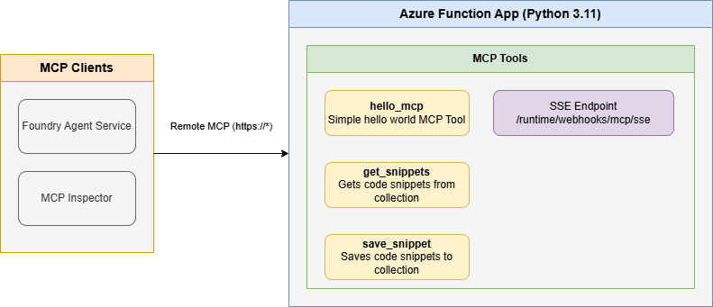

<!--
---
name: Remote MCP with Azure Functions (Python)
description: Run a remote MCP server on Azure functions.  
page_type: sample
languages:
- python
- bicep
- azdeveloper
products:
- azure-functions
- azure
urlFragment: remote-mcp-functions-python
---
-->

# Getting Started with Remote MCP Servers using Azure Functions (Python)

This is a quickstart template to easily build and deploy a custom remote MCP server to the cloud using Azure Functions with Python. You can clone/restore/run on your local machine with debugging, and `azd up` to have it in the cloud in a couple minutes. The MCP server is secured by design using keys and HTTPS, and allows more options for OAuth using built-in auth and/or [API Management](https://aka.ms/mcp-remote-apim-auth) as well as network isolation using VNET.

If you're looking for this sample in more languages check out the [.NET/C#](https://github.com/Azure-Samples/remote-mcp-functions-dotnet) and [Node.js/TypeScript](https://github.com/Azure-Samples/remote-mcp-functions-typescript) versions.

[](https://codespaces.new/Azure-Samples/remote-mcp-functions-python)

Below is the architecture diagram for the Remote MCP Server using Azure Functions with Foundry Agent Service:



## Prerequisites

+ [Python](https://www.python.org/downloads/) version 3.11 or higher
+ [Azure Functions Core Tools](https://learn.microsoft.com/azure/azure-functions/functions-run-local?pivots=programming-language-python#install-the-azure-functions-core-tools) >= `4.0.7030`
+ [Azure Developer CLI](https://aka.ms/azd)
+ To use Visual Studio Code to run and debug locally:
  + [Visual Studio Code](https://code.visualstudio.com/)
  + [Azure Functions extension](https://marketplace.visualstudio.com/items?itemName=ms-azuretools.vscode-azurefunctions)

## Prepare your local environment

An Azure Storage Emulator is needed for this particular sample because we will save and get snippets from blob storage.

1. Start Azurite

    ```shell
    docker run -p 10000:10000 -p 10001:10001 -p 10002:10002 \
        mcr.microsoft.com/azure-storage/azurite
    ```

>**Note** if you use Azurite coming from VS Code extension you need to run `Azurite: Start` now or you will see errors.

## Run your MCP Server locally from the terminal

1. Change to the src/mcp_server folder in a new terminal window:

   ```shell
   cd src/mcp_server
   ```

1. Install Python dependencies:

   ```shell
   pip install -r requirements.txt
   ```

>**Note** it is a best practice to create a Virtual Environment before doing the `pip install` to avoid dependency issues/collisions, or if you are running in CodeSpaces.  See [Python Environments in VS Code](https://code.visualstudio.com/docs/python/environments#_creating-environments) for more information.

1. Start the Functions host locally:

   ```shell
   func start
   ```

> **Note** by default this will use the webhooks route: `/runtime/webhooks/mcp/sse`.  Later we will use this in Azure to set the key on client/host calls: `/runtime/webhooks/mcp/sse?code=<system_key>`

## Connect to the *local* MCP server from a client/host

### Foundry Agent Service Client

The Foundry Agent Service is a cloud service that expects MCP tools that are also in the cloud (e.g. same VNET or on public internet).  Proceed to the steps around deploying the Azure for Remote MCP.

### MCP Inspector

1. In a **new terminal window**, install and run MCP Inspector

    ```shell
    npx @modelcontextprotocol/inspector
    ```

2. CTRL click to load the MCP Inspector web app from the URL displayed by the app (e.g. http://0.0.0.0:5173/#resources)
3. Set the transport type to `SSE`
4. Set the URL to your running Function app's SSE endpoint and **Connect**:

    ```shell
    http://0.0.0.0:7071/runtime/webhooks/mcp/sse
    ```

>**Note** this step will not work in CodeSpaces.  Please move on to Deploy to Remote MCP.  


## Deploy to Azure for Remote MCP

Run this [azd](https://aka.ms/azd) command to provision the function app, with any required Azure resources, and deploy your code:

```shell
azd up
```

You can opt-in to a VNet being used in the sample. To do so, do this before `azd up`

```bash
azd env set VNET_ENABLED true
```

Additionally, [API Management]() can be used for improved security and policies over your MCP Server, and [App Service built-in authentication](https://learn.microsoft.com/azure/app-service/overview-authentication-authorization) can be used to set up your favorite OAuth provider including Entra.  

## Connect to your *remote* MCP server function app from a client

Your client will need a key in order to invoke the new hosted SSE endpoint, which will be of the form `https://<funcappname>.azurewebsites.net/runtime/webhooks/mcp/sse`. The hosted function requires a system key by default which can be obtained from the [portal](https://learn.microsoft.com/azure/azure-functions/function-keys-how-to?tabs=azure-portal) or the CLI (`az functionapp keys list --resource-group <resource_group> --name <function_app_name>`). Obtain the system key named `mcp_extension`.

### Foundry Agent Service Client

1. Change to the agent folder in a new terminal window:

   ```shell
   cd agent
   ```

2. Create a `.env` file based on the example provided. Copy the `.env.example` file:

   ```shell
   copy .env.example .env
   ```

3. Edit the `.env` file with your deployed function app details:

   ```env
   # Azure AI Project Configuration
   PROJECT_ENDPOINT=https://your-agent-service-resource.services.ai.azure.com/api/projects/your-project-name
   MODEL_DEPLOYMENT_NAME=chat
   MCP_SERVER_LABEL=Azure_Functions_MCP_Server
   MCP_SERVER_URL=https://<your-funcappname>.azurewebsites.net/runtime/webhooks/mcp/sse
   USER_MESSAGE=Create a snippet called snippet1 that prints 'Hello, World!' in Python.

   # Required: Azure Functions extension key for MCP server authentication
   MCP_EXTENSION_KEY=your_mcp_extension_system_key_here
   ```

   > **Note**: Replace the following values with outputs from your `azd up` deployment:
   > - `PROJECT_ENDPOINT`: Your Azure AI Project endpoint (from azd deployment output)
   > - `<your-funcappname>`: Your function app name (from azd deployment output)
   > - `your_mcp_extension_system_key_here`: The `mcp_extension` system key obtained from the Azure portal or CLI

4. Install Python dependencies for the agent:

   ```shell
   pip install -r requirements.txt
   ```

5. Run the agent service:

   ```shell
   python main.py
   ```

   The agent will connect to your remote MCP server and execute the message specified in the `USER_MESSAGE` environment variable, demonstrating the integration between Azure AI Foundry and your deployed MCP server.

### Connect to remote MCP server in MCP Inspector
For MCP Inspector, you can include the key in the URL: 
```plaintext
https://<funcappname>.azurewebsites.net/runtime/webhooks/mcp/sse?code=<your-mcp-extension-system-key>
```

## Redeploy your code

You can run the `azd up` command as many times as you need to both provision your Azure resources and deploy code updates to your function app.

>[!NOTE]
>Deployed code files are always overwritten by the latest deployment package.

## Clean up resources

When you're done working with your function app and related resources, you can use this command to delete the function app and its related resources from Azure and avoid incurring any further costs:

```shell
azd down
```

## Helpful Azure Commands

Once your application is deployed, you can use these commands to manage and monitor your application:

```bash
# Get your function app name from the environment file
FUNCTION_APP_NAME=$(cat .azure/$(cat .azure/config.json | jq -r '.defaultEnvironment')/env.json | jq -r '.FUNCTION_APP_NAME')
echo $FUNCTION_APP_NAME

# Get resource group 
RESOURCE_GROUP=$(cat .azure/$(cat .azure/config.json | jq -r '.defaultEnvironment')/env.json | jq -r '.AZURE_RESOURCE_GROUP')
echo $RESOURCE_GROUP

# View function app logs
az webapp log tail --name $FUNCTION_APP_NAME --resource-group $RESOURCE_GROUP

# Redeploy the application without provisioning new resources
azd deploy
```

## Source Code

The function code for the `get_snippet` and `save_snippet` endpoints are defined in the Python files in the `src/mcp_server` directory. The MCP function annotations expose these functions as MCP Server tools.

Here's the actual code from the function_app.py file:

```python

@app.generic_trigger(arg_name="context", type="mcpToolTrigger", toolName="hello", 
                     description="Hello world.", 
                     toolProperties="[]")
def hello_mcp(context) -> None:
    """
    A simple function that returns a greeting message.

    Args:
        context: The trigger context (not used in this function).

    Returns:
        str: A greeting message.
    """
    return "Hello I am MCPTool!"


@app.generic_trigger(
    arg_name="context",
    type="mcpToolTrigger",
    toolName="getsnippet",
    description="Retrieve a snippet by name.",
    toolProperties=tool_properties_get_snippets_json
)
@app.generic_input_binding(
    arg_name="file",
    type="blob",
    connection="AzureWebJobsStorage",
    path=_BLOB_PATH
)
def get_snippet(file: func.InputStream, context) -> str:
    """
    Retrieves a snippet by name from Azure Blob Storage.
 
    Args:
        file (func.InputStream): The input binding to read the snippet from Azure Blob Storage.
        context: The trigger context containing the input arguments.
 
    Returns:
        str: The content of the snippet or an error message.
    """
    snippet_content = file.read().decode("utf-8")
    logging.info(f"Retrieved snippet: {snippet_content}")
    return snippet_content


@app.generic_trigger(
    arg_name="context",
    type="mcpToolTrigger",
    toolName="savesnippet",
    description="Save a snippet with a name.",
    toolProperties=tool_properties_save_snippets_json
)                   
@app.generic_output_binding(
    arg_name="file",
    type="blob",
    connection="AzureWebJobsStorage",
    path=_BLOB_PATH
)
def save_snippet(file: func.Out[str], context) -> str:
    content = json.loads(context)
    snippet_name_from_args = content["arguments"][_SNIPPET_NAME_PROPERTY_NAME]
    snippet_content_from_args = content["arguments"][_SNIPPET_PROPERTY_NAME]

    if not snippet_name_from_args:
        return "No snippet name provided"

    if not snippet_content_from_args:
        return "No snippet content provided"
 
    file.set(snippet_content_from_args)
    logging.info(f"Saved snippet: {snippet_content_from_args}")
    return f"Snippet '{snippet_content_from_args}' saved successfully"
```

Note that the `host.json` file also includes a reference to the experimental bundle, which is required for apps using this feature:

```json
"extensionBundle": {
  "id": "Microsoft.Azure.Functions.ExtensionBundle.Experimental",
  "version": "[4.*, 5.0.0)"
}
```

## Next Steps

- Add [API Management](https://aka.ms/mcp-remote-apim-auth) to your MCP server (auth, gateway, policies, more!)
- Add [built-in auth](https://learn.microsoft.com/en-us/azure/app-service/overview-authentication-authorization) to your MCP server
- Enable VNET using VNET_ENABLED=true flag
- Learn more about [related MCP efforts from Microsoft](https://github.com/microsoft/mcp/tree/main/Resources)
